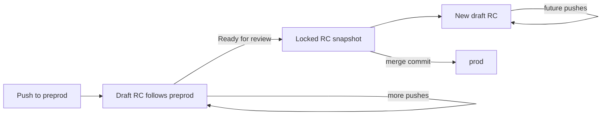

# Rolling release-candidate demo

This repository demonstrates a two-environment Git strategy:

- `preprod` is the default integration branch (it replaces `main`).
- `prod` is the exact history promoted to production.
- `release-candidate/*` branches are disposable snapshots owned by automation.

Every commit added to `preprod` is collected into one draft pull request targeting `prod`. While that pull request is a draft, its generated branch advances with `preprod`. Clicking **Ready for review** is the release lock: the branch freezes at the exact SHA shown at that moment and a new rolling draft is opened for subsequent work.



The snapshot branch is an implementation detail, but it is necessary: GitHub pull requests always compare a base ref with a head ref. A pull request whose head was `preprod` itself would continue changing after it was made ready and therefore could not be locked.

## One-time setup

The two long-lived branches must start at the same baseline commit. For this greenfield demo:

```bash
git add .
git commit -m "Add rolling release-candidate demo"
git branch -M preprod
git push origin HEAD:prod
git push -u origin preprod
gh repo edit --default-branch preprod
```

Once `preprod` is the GitHub default branch, the old remote `main` can be deleted if it is no longer wanted:

```bash
git push origin --delete main
```

In **Settings → Actions → General → Workflow permissions**:

1. Select **Read and write permissions**.
2. Enable **Allow GitHub Actions to create and approve pull requests**.

In the repository merge settings, keep **Allow merge commits** enabled. Protect `prod` so changes require a pull request, and protect `preprod` because the privileged workflow is loaded from that default branch.

## Try the strategy

Create two ordinary commits on `preprod`:

```bash
date -Iseconds > demo-change.txt
git add demo-change.txt
git commit -m "Demo change one"
git push

date -Iseconds >> demo-change.txt
git commit -am "Demo change two"
git push
```

The same draft release-candidate PR advances to include both commits. In GitHub:

1. Open that draft and note its short snapshot SHA.
2. Click **Ready for review**.
3. Confirm the PR gains `release-candidate:locked` and keeps that SHA.
4. Push another commit to `preprod` and confirm only the new draft advances.
5. Merge the locked PR into `prod` using **Create a merge commit**.

Merge commits are required for promotion PRs. Squash or rebase merging creates different commit IDs on `prod`, so Git would continue to report the original `preprod` commits as unreleased.

If `prod` catches all the way up to `preprod`, the automation closes the now-empty rolling draft. A later `preprod` commit starts a fresh candidate.

## Operational rules

- Do not push to, rename, or delete `release-candidate/*` branches manually.
- Do not edit the generated PR title, body, or release-candidate labels; comments and reviews are safe.
- Making a locked PR a draft again does **not** unlock it. Locking is deliberately one-way.
- Closing a rolling PR while unreleased commits remain causes the workflow to create a replacement.
- Several locked candidates may coexist, but there is at most one rolling draft.
- Promote locked candidates in order and use a merge commit into `prod`.

The workflow uses `pull_request_target` so it can react to **Ready for review** with write access. GitHub loads that workflow from the trusted default branch; it never checks out or executes the candidate PR head.

## Reconcile manually

Run **Rolling release candidate → Run workflow** in GitHub after correcting any manual state. The complete implementation is the single workflow in `.github/workflows/release-candidate.yml`; it uses the `gh` CLI already installed on GitHub-hosted runners and has no application dependencies.
